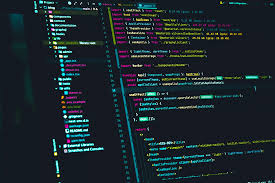

## Compare to other programming language
It's been a few weeks since I started using JavaScript, but I've used Java and C++ before, so I don't think there's much of a difference in terms of basics. However, since they are all different programming languages, there are differences in how they work and how they are written, and writing algorithms is no exception. Algorithms can be written in other languages, but they may not work well in JavaScript.

## Opinion about the JavaScript
I'm a little confused about JavaScript because this is the first language I've learned in a few weeks and I've learned different programming languages before, and at FreeCodeCamp I learned a lot of different mechanisms and functions, so I'm completely different in a different language. I knew it was nothing, but I still found it difficult. As a result of thinking about my own reasons, I thought that I myself did not clearly understand how the program works. There was a lot to learn.

I think that JavaScript is a good programming language from a software engineering point of view, because compared to the languages ​​I have used so far, JavaScript that I thought can be roughly divided into two simple functions: function and data input. I will write a very easy-to-read Pseudocode Algorithm, so I thought it would be very useful for creating software because it is very convenient and easy to read, so it is efficient and very useful when creating in a group.

## Thought on Athletic Software Engineering
I personally think that athletic software engineering has a lot to learn. Improve your programming skills, deepen your understanding, and be able to quickly build structures and write programs. With this learning style, it can be a little frustrating when you get stuck because you don't quite understand how it works, or when building code doesn't go as planned. will help deepen your understanding. Practicing and understanding WOD is invaluable because it will help you grow, code faster, and save time and knowledge in the future. And since you always have to learn new things, this athletic software engineering is done as if you were actually writing code, so it is very useful in practice and you can experience growth and understanding by measuring time.
