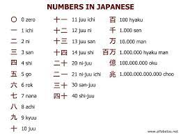

This program is created in few weeks that I learned the C language. In this program using switch statement that makes separate by oneth place, tenth place, hundread place and thousand place for user input but there is limit on the input that cannot be takes more than 10,000. This is not takes all numbers until 9999 it using divides the number of input to takes one digit number and output the Japanese word of numbers. So if users input the number of 192, function will run to divide and takes one digit in each of places and does one digit will sended into switch statement to figure out the Japanese word number and output the Japanese words from the biggest place. For output of 192 will be a hyaku-kyuujuu-ni.

This is the part of the cord that use to figure out the number of places by turn in user input into one digit:

```//for loop until reach to 9999
    for(x=1; x < LIMIT; x++){
        //take out number into one digit
        int one = (x / 1) % 10;
        int ten = (x / 10) % 10;
        int hundred = (x / 100) % 10;
        int thousand = (x / 1000) % 10;
        printf("%i", x);
        printf(" = ");
```

Source: <a href="https://github.com/km584/km584.github.io/blob/main/a7km321.c">PokemonFrame</a>
